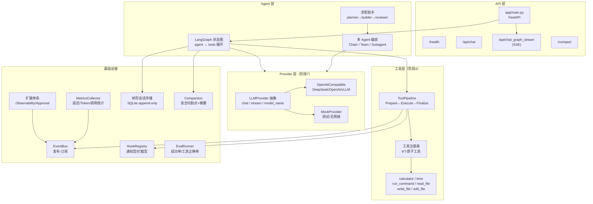

# Personal AI Agent

从零手写的 **Personal AI Agent 学习项目**：以"极简核心 + 深度可扩展"为目标，逐步搭建一个可对话、会调工具、能流式输出、可持久化、支持多 Agent 编排的个人 Agent。

> 📚 **全部学习文档与计划见 [`docs/README.md`](docs/README.md)（文档总索引）**
> 📖 **设计复盘与面试题见 [`docs/05_学习复盘与面试/`](docs/05_学习复盘与面试/)**

## 当前进度

```
阶段 0 ✅  FastAPI + LLM 最小闭环
阶段 1 ✅  V1 工程化 Tool Agent（BaseTool + 注册表 + 有界循环）
阶段 2 ✅  V2 多轮对话 + SQLite 记忆
阶段 3 ✅  V3 LangGraph + Checkpoint + SSE 流式 + HITL 审批
阶段 4 ✅  原子工具 + 工具管道（6个工具 + 三阶段执行 + 审计日志）
阶段 5 ✅  EventBus + 分层 Hooks + 扩展体系（Observability/Approval）
阶段 6 ✅  树形会话 + Compaction 压缩（Fork/回滚/自动压缩）
阶段 7 ✅  Provider 抽象层（多模型切换 + Mock + 流式统一）
阶段 8 ✅  多 Agent 编排（Chain 流水线 / Team 调度器 / Subagent 并行）
阶段 9 🔄  生产化（可观测性 + 评估 + Docker + 文档收尾）
```

**测试基线：130+ passed**

---

## 架构总览



---

## 目录结构

```
├── app/
│   ├── main.py              # FastAPI 入口（/health, /api/chat, /api/chat_graph_stream）
│   ├── config.py            # pydantic-settings 配置（.env）
│   ├── graph_agent.py       # LangGraph 非流式图（+树形存储+自动压缩）
│   ├── graph_agent_hitl.py  # LangGraph HITL 图（interrupt 异步审批）
│   ├── stream_graph.py      # LangGraph SSE 流式图
│   ├── graph_state.py       # AgentState 定义
│   ├── llm.py               # 阶段1遗留 OpenAI client（已被 Provider 层替代）
│   ├── providers/           # 阶段7：LLM Provider 抽象层
│   │   ├── base.py          #   LLMProvider ABC + LLMResponse
│   │   ├── openai_compat.py #   OpenAI 兼容实现
│   │   ├── mock.py          #   Mock 实现
│   │   └── factory.py       #   ProviderFactory（配置驱动）
│   ├── orchestration/       # 阶段8：多 Agent 编排
│   │   ├── chain.py         #   AgentChain 顺序流水线（$INPUT/$ORIGINAL）
│   │   ├── team.py          #   AgentTeam 调度器（动态选子Agent）
│   │   ├── subagent.py      #   HeadlessSubagent 后台并行（EventBus上报）
│   │   └── job_assistant.py #   求职助手主线（planner→builder→reviewer）
│   ├── event_bus.py         # 阶段5：事件总线（发布-订阅）
│   ├── hooks.py             # 阶段5：分层钩子（通知型/拦截型短路）
│   ├── extensions/          # 阶段5：扩展体系
│   │   ├── base.py          #   BaseExtension 抽象
│   │   ├── manager.py       #   ExtensionManager 两阶段加载
│   │   ├── context.py       #   ExtensionContext
│   │   ├── observability.py #   结构化 JSON 日志
│   │   └── approval.py      #   危险工具审批拦截
│   ├── composition_root.py  # 组装层工厂（create_pipeline）
│   ├── session_store.py     # 阶段6：树形会话存储（SQLite append-only）
│   ├── compaction.py        # 阶段6：压缩算法（安全切割点+摘要）
│   ├── session_adapter.py   # 阶段6：entry↔Message 互转
│   ├── metrics.py           # 阶段9：指标收集器
│   ├── evaluation.py        # 阶段9：评估框架
│   ├── schema.py            # API 请求/响应模型
│   └── db.py                # 数据库初始化
├── tools/
│   ├── base.py              # BaseTool 抽象（execute 自带异常兜底）
│   ├── registry.py          # 工具注册表 + TOOL_SCHEMA
│   ├── pipeline.py          # ToolPipeline 三阶段执行
│   ├── calculator.py        # 计算器
│   ├── time_tool.py         # 当前时间
│   ├── run_command.py       # 运行命令（默认 mock）
│   ├── read_file.py         # 读文件
│   ├── write_file.py        # 写文件
│   └── edit_file.py         # 编辑文件
├── demo/                    # 命令行联调演示
├── test/                    # pytest 自动化测试（130+ passed）
├── docs/                    # ★ 全部文档（计划/笔记/总结/架构学习/复盘面试）
├── Dockerfile               # 阶段9：容器化
├── docker-compose.yml       # 阶段9：一键启动
└── requirements.txt
```

---

## 快速开始

### 方式一：本地运行

```powershell
# 1. 创建虚拟环境并安装依赖
python -m venv .venv
.venv\Scripts\Activate.ps1
pip install -r requirements.txt

# 2. 配置 .env
# LLM_API_KEY=sk-xxx
# LLM_BASE_URL=https://api.deepseek.com/v1
# LLM_MODEL=deepseek-chat
# LLM_PROVIDER=openai_compat   # 或 mock（无网络时用）

# 3. 启动 API 服务
.venv\Scripts\python.exe -m uvicorn app.main:app --port 8000

# 4. 健康检查
Invoke-RestMethod http://127.0.0.1:8000/health

# 5. 运行测试
.venv\Scripts\python.exe -m pytest test/ -q
```

### 方式二：Docker 一键启动

```bash
# 构建并启动
docker compose up -d --build

# 查看日志
docker compose logs -f

# 停止
docker compose down
```

服务启动后访问 `http://localhost:8000/health` 确认健康状态。

---

## API 文档

### `GET /health`

健康检查。

**响应：**
```json
{"status": "ok,也是成功打开了"}
```

### `POST /api/chat`

非流式对话（LangGraph + Checkpoint 会话持久化）。

**请求：**
```json
{
  "message": "你好",
  "session_id": "default_session"
}
```

**响应：**
```json
{
  "response": "你好！有什么可以帮你的？"
}
```

### `POST /api/chat_graph_stream`

SSE 流式对话。请求体同 `/api/chat`，响应为 `text/event-stream`，逐 token 推送。

### `POST /compact`

手动触发会话压缩（force=True 忽略阈值）。

**请求：**
```json
{
  "session_id": "default_session"
}
```

---

## 核心设计亮点

| 阶段 | 亮点 | 关键文件 |
|---|---|---|
| 3 | LangGraph 状态图 + 条件边路由 + SSE 流式 | `graph_agent.py`, `stream_graph.py` |
| 4 | ToolPipeline 三阶段执行 + 审计日志 + before/after 钩子 | `tools/pipeline.py` |
| 5 | EventBus 发布-订阅 + 拦截型钩子短路 + 扩展两阶段加载 | `event_bus.py`, `hooks.py`, `extensions/` |
| 6 | append-only 树形存储 + 安全切割点压缩（工具调用/结果同生共死） | `session_store.py`, `compaction.py` |
| 7 | LLMProvider 抽象 + 配置驱动切换 + Mock 一等公民 | `providers/` |
| 8 | Chain/Team/Subagent 三种编排模式 + $INPUT/$ORIGINAL 意图锚定 | `orchestration/` |
| 9 | MetricsCollector 指标聚合 + EvalRunner 评估框架 + Docker 化 | `metrics.py`, `evaluation.py`, `Dockerfile` |

---

## 环境

- Python 3.11+ · FastAPI · LangGraph · OpenAI SDK（DeepSeek 兼容）
- 模型配置在 `.env`，由 `app/config.py` 读取
- 零额外服务依赖（SQLite 内嵌，无需 Redis/PostgreSQL）
